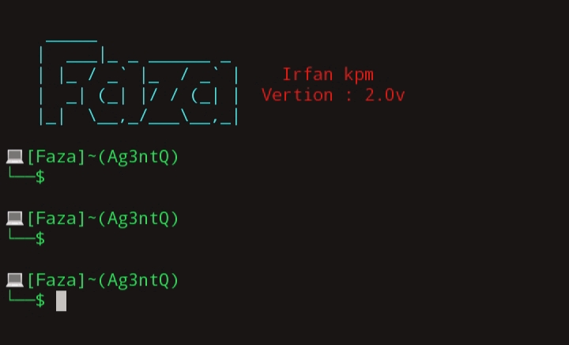
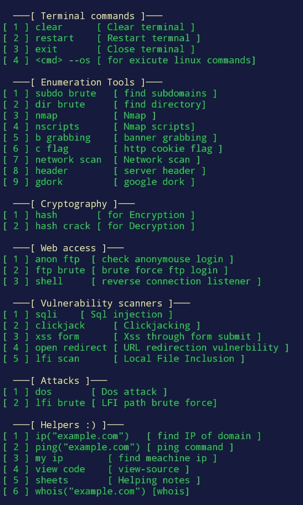

# Faza terminal

-  simple  tool for pen testers
- Use small letter only for commands
- Don't use space after command
- 'help' for more information

# Installation
- git clone https://github.com/Ag3ntQ/Faza.git
- cd faza
- python fazaconfig.py [ at first time ]
- python faza.py

# Tools

# you can run faza with command 'faza' in termux 

